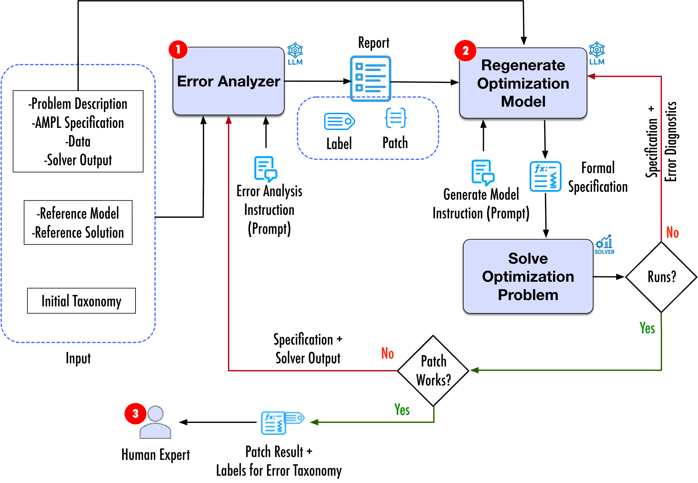

# Error Analysis of LLM-Generated Optimization Specifications

### Patch-validated Root-cause Investigation of Specification Mistakes (PRISM)

## Overview
PRISM is a LangGraph workflow for qualitative error analysis of generated AMPL optimization specifications. It compares a generated AMPL model against the problem description, reference model, data, and solver output; assigns error labels from an evolving taxonomy; proposes a minimal patch; and validates the patch by solving the corrected optimization model and comparing its objective value with the reference objective.

The study analyzes 231 non-perfect AMPL specifications from [EXEOS](https://github.com/neayoughi/EXEOS) runs, including compilation errors, runtime errors, and executable specifications with incorrect objective values. PRISM produced successful automated patches for 182 of the 231 cases, a 78.8% patch-validation rate, and the validated records were used to refine the final error taxonomy.



## Repository Contents

- `src/agents/`: LangGraph workflow, command-line entry point, analysis, patch evaluation, AMPL execution, schema, rendering, and model-provider modules.
- `prompts/`: taxonomy, task template, output schema, and prompt files used by the workflow.
- `data/EXEOS/`: selected Excel workbooks for erroneous AMPL specifications.
- `result/`: combined human-validation result files, ordered first by Gemini 2.5 Pro cases and then by o4-mini cases.
- `assets/prism-approach.png`: approach overview figure.

Reference solutions and the full `data/Solution` directory are intentionally not included.

## Included Data

The public data subset contains:

- `data/EXEOS/AMPL4-gemini2.5/ErrorAnalysis_AMPL4-gemini2.5pro.xlsx`
- `data/EXEOS/AMPL4-o4mini/ErrorAnalysis_AMPL-o4mini.xlsx`
- `result/batch_report_human_validated.csv`
- `result/batch_patch_eval_human_validated.csv`

Each combined result file contains 231 cases: 97 Gemini 2.5 Pro cases followed by 134 o4-mini cases. The `model` column identifies the source model for repeated `problem_id` and `run_id` pairs, and the `human_validation` column preserves the validated True/False status.

## Setup

Create and activate a Python environment, then install the dependencies:

```bash
python -m venv .venv
source .venv/bin/activate
python -m pip install -r requirements.txt
```

AMPL, `amplpy`, and the Gurobi AMPL module are required for patch-validation runs that execute optimization models.

Copy `config.example.json` to `config.json` and fill only the provider fields needed for your run. You can also point to a configuration file with:

```bash
export EXEOS_CONFIG_PATH=/path/to/config.json
```

## Run One Case

Provide paths to a generated run, a reference solution, and an output directory:

```bash
PYTHONPATH=src python -m agents.run_one \
  --gen_run_dir /path/to/generated/run \
  --ref_solution_dir /path/to/reference/solution \
  --out_dir reports_langgraph/example \
  --model vertex-gemini-2.5-pro \
  --max_patch_refinement_attempts 5 \
  --max_analysis_cycles 5
```

The command writes `record.json`, `initial_record.json`, `patch_eval.json`, `workflow_trace.json`, `record.csv`, `patch_eval.csv`, and a rendered Markdown report to the output directory.
